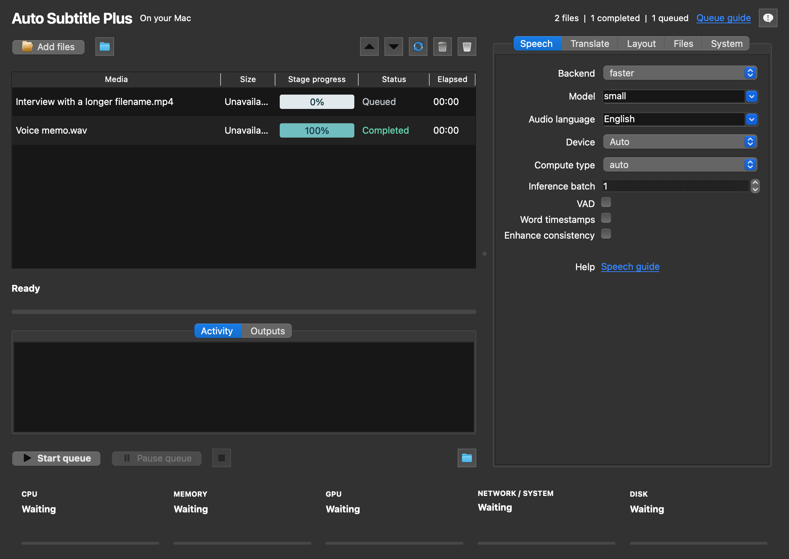
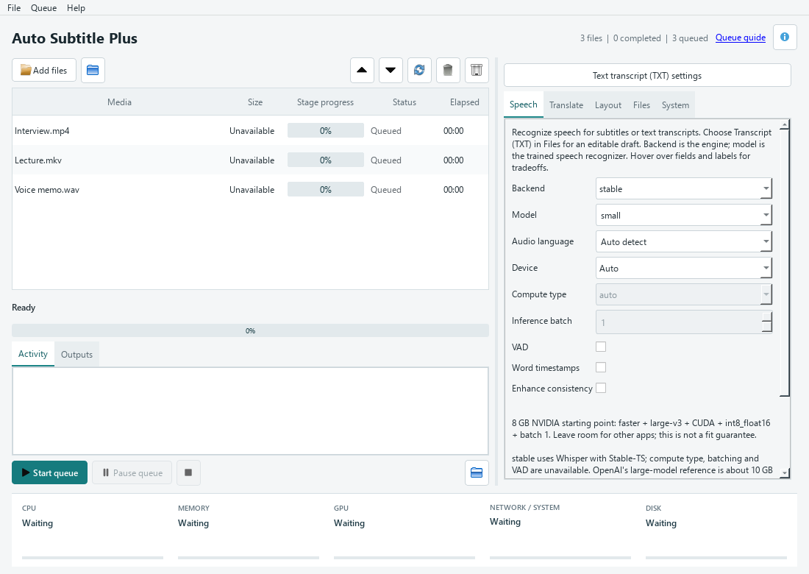
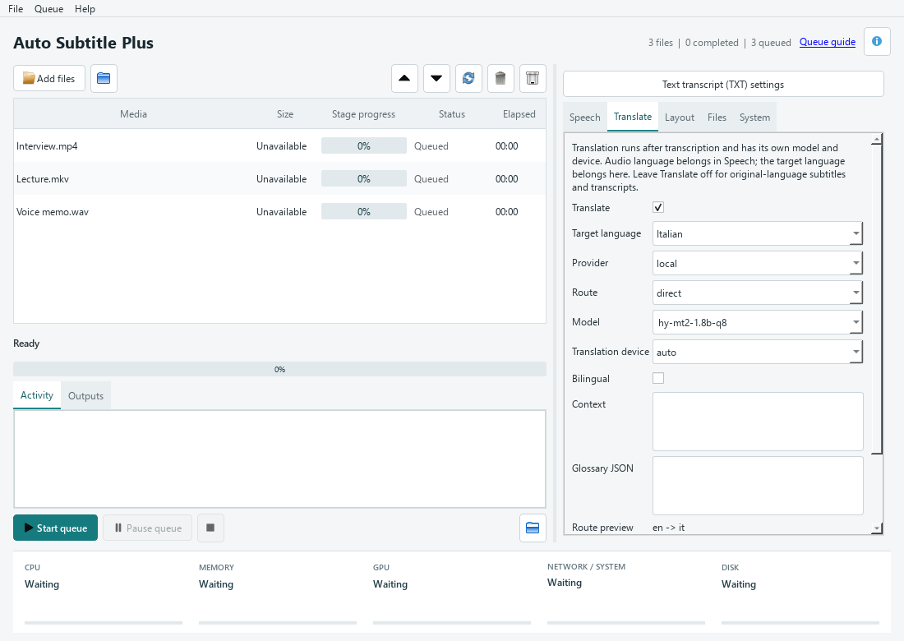

# Auto Subtitle Plus

[Website & downloads](https://sectumsempra82.github.io/auto-subtitle-plus/) · [User guide](https://sectumsempra82.github.io/auto-subtitle-plus/guide/)

Auto Subtitle Plus generates subtitles for video or audio files, can optionally translate them, and can embed subtitles back into video outputs.

This fork keeps original-language subtitles as the default. Translation only happens when `--translate-to` is provided, and bilingual output only happens when `--bilingual` is provided.

## macOS desktop preview

[Download for Apple Silicon](https://github.com/Sectumsempra82/auto-subtitle-plus/releases/download/v0.3.0-rc.3/AutoSubtitlePlus-GUI-macOS-arm64.zip) · [Release notes and SHA-256](https://github.com/Sectumsempra82/auto-subtitle-plus/releases/tag/v0.3.0-rc.3) · [Mac setup guide](https://sectumsempra82.github.io/auto-subtitle-plus/guide/#macos)

**v0.3.0-rc.3** includes a native macOS `.app` with Python and processing libraries bundled. Extract it, move it to Applications, and install **FFmpeg** separately (`brew install ffmpeg` for Homebrew users). Requires Apple Silicon and macOS 26+; tested on macOS 26.5. Intel Macs and older macOS versions have not been validated.

The app is ad-hoc signed, **not Developer ID signed or notarized**. If macOS blocks its first launch, use Privacy & Security → Open Anyway only after verifying the download and deciding you trust it. Do not disable system protection.

The Mac GUI processes local files and offers local translation only. Model weights download on first use; cached models work offline. Start with CPU. CUDA and Windows-only Hy-MT2 are rejected before a job starts. The default local translation model is M2M100-418M. No accounts or cloud service are required.

Native tabs follow light/dark appearance, Finder can open media in the app, and Command shortcuts control files and the queue. Settings and queue state live in `~/Library/Application Support/AutoSubtitlePlus/desktop/state.json`; models stay outside the app. Replacing the app preserves them.



[Build and validation instructions](packaging/macos.md). The existing [Windows GUI and CLI downloads remain v0.3.0-rc.2](https://github.com/Sectumsempra82/auto-subtitle-plus/releases/tag/v0.3.0-rc.2); this release does not contain rebuilt Windows executables.

## CLI And Desktop

### Screenshots

Actual desktop UI with example queue filenames.





Both frontends use the same processing library. The CLI has no Qt dependency;
the optional desktop frontend adds a single-window local-file queue, settings,
progress, output browsing, persistent queue state, and live resource meters.

```powershell
pip install -e ".[gui,faster-cuda,benchmark]"
auto_subtitle_plus_gui
# Equivalent desktop module entry point:
python -m auto_subtitle_plus.desktop
# The existing CLI remains available:
auto_subtitle_plus video.mp4 --output-srt
```

The pip-installed Windows launchers are `auto_subtitle_plus.exe` and
`auto_subtitle_plus_gui.exe`. Those launchers require Python. Separate portable
Windows builds acquire app-local Python and processing runtimes on first use; see below. Desktop support uses the pinned
`PySide6-Essentials` package; normal CLI installations do not require it.

The desktop accepts local audio/video files, multiple selection, drag-and-drop,
and local folders (top-level media only). It rejects URLs and UNC network
paths. Reorder or remove queued items, retry selected items, or clear completed
items without deleting media. Settings apply to the pending batch when Start
is pressed and stay locked while it runs. Adding files during a batch uses that
batch's settings. Pause finishes the current file; Cancel stops it and pauses
the queue. Failed files remain visible with diagnostics while later jobs continue.

Settings are grouped into Speech, Translate, Layout, Files, and System tabs.
Hover over a setting or its label for explanations, units, requirements and
tradeoffs. Labels retain their help when an individual setting is disabled.
Queue actions, progress indicators, output files and resource meters also provide
hover help. Each settings tab has a clickable guide link, and **Queue guide**
opens the [desktop and queue manual](https://sectumsempra82.github.io/auto-subtitle-plus/guide/#queue).
These links open your browser; the tooltips themselves work offline.
The tabs expose the supported backend/model/device options, local or, on Windows, explicitly
online translation, direct/pivot routing, context/glossary, caption readability,
all output formats, offline mode, stage retries, and cache location/clearing.
Legacy no-op translation worker flags are intentionally not GUI controls.
Desktop output defaults beside each source file; replacement is off by default
and requires confirmation when enabled. CLI output defaults remain unchanged.

On Windows, queue/settings state is stored in `%LOCALAPPDATA%\AutoSubtitlePlus\desktop`.
Restoring a queue never starts it automatically. Active jobs interrupted by a
restart are marked interrupted. Queue state contains local filenames; it is
not uploaded or included in Git.

Progress is stage-specific: extraction/encoding use FFmpeg progress and
translation/downloads use engine events. Stages without reliable percentages
show indeterminate progress and elapsed time rather than a fabricated estimate.
Resource meters show system CPU/RAM, application process-tree CPU/RAM, GPU
load and used/total VRAM when `nvidia-smi` is available, disk capacity, and
system-wide network rates/totals since launch. Network totals are not attributed
to this application. Unavailable telemetry is explicitly identified.

### Shared Library

`auto_subtitle_plus.api` provides `JobOptions`, `JobRunner`, and `JobResult`.
The persistent runner provides a cancellable process boundary for desktop and
other hosts; `auto_subtitle_plus.processing` owns the actual transcription,
translation and export orchestration used by both frontends.
`auto_subtitle_plus.resources.ResourceMonitor` is Qt-independent telemetry.
Only `auto_subtitle_plus.desktop` owns widgets and desktop queue persistence.

```python
from auto_subtitle_plus.api import JobOptions, JobRunner

if __name__ == "__main__":
    runner = JobRunner()
    try:
        result = runner.run(
            JobOptions(path=r"C:\Media\clip.mp4", output_srt=True),
            progress=lambda event: print(event),
            cancel=lambda: False,
        )
        print(result.status, result.outputs, result.error)
    finally:
        runner.close()
```

Additional CLI controls: `--progress-json`, `--resources`, `--no-overwrite`,
`--max-chars-per-line`, `--max-lines`, `--max-cps`, `--min-duration`,
`--max-duration`, `--context`, and `--glossary`. Use `--help` for the exact
value formats. These controls call the shared library, not a separate GUI engine.

### Desktop Credits

- [Qt / PySide6](https://code.qt.io/cgit/pyside/pyside-setup.git/) and The Qt Company/contributors: native widgets, standard icons, signals and threading. Community libraries carry LGPLv3/GPLv3 terms; their notices and applicable redistribution obligations remain separate from this project's MIT license. See [Qt licensing](https://doc.qt.io/qtforpython-6/licenses.html).
- [psutil](https://github.com/giampaolo/psutil), Giampaolo Rodola and contributors: shared system/process telemetry, BSD-3-Clause.
- [Subtitle Edit](https://github.com/SubtitleEdit/subtitleedit), Nikolaj Olsson and contributors: inspiration for compact subtitle-oriented desktop controls. Its current [license](https://github.com/SubtitleEdit/subtitleedit/blob/main/LICENSE) is MIT. No source code or artwork was copied.
- [NVIDIA System Management Interface](https://docs.nvidia.com/deploy/nvidia-smi/index.html): optional GPU measurements through the user's installed driver tool; no NVIDIA executable is redistributed by the GUI package.

All existing fork, model, and runtime credits below continue to apply to both
frontends. Portable builds include dependency notices and matching application
source; public redistribution additionally requires the licensing checks below.

### Portable Windows Editions

Download the current **Windows x64 release candidate** from
[GitHub Releases](https://github.com/Sectumsempra82/auto-subtitle-plus/releases/tag/v0.3.0-rc.2):

- [CLI ZIP](https://github.com/Sectumsempra82/auto-subtitle-plus/releases/download/v0.3.0-rc.2/AutoSubtitlePlus-CLI-Windows-x64.zip)
- [GUI ZIP](https://github.com/Sectumsempra82/auto-subtitle-plus/releases/download/v0.3.0-rc.2/AutoSubtitlePlus-GUI-Windows-x64.zip)

Each archive is under 2 MiB, not an all-dependencies bundle. Initial
CLI CPU dependency archives total approximately 472 MiB; prepared runtime files
occupy approximately 1.91 GiB, plus retained download archives and model weights.
GUI and optional GPU dependencies add to those totals. The builds are unsigned.
CPU setup, offline transcription/translation and GUI queue execution were tested
on the development machine. Clean-Windows and the new CUDA-bootstrap path remain
unverified; this release is explicitly a pre-release, not a certified installer.

`Build Portable.cmd` rebuilds both small Windows x64 launcher editions from the
current code, runs regression tests, and creates ZIPs with checksums under
`dist/windows-light`. No installed Python is needed on the destination.
See [build commands, prerequisites, validation and licensing](packaging/README.md).

Extract the whole ZIP and launch the CLI or GUI executable. First run downloads
pinned, checksum-verified Python, FFmpeg and library packages into app-local
storage. CPU is the initial runtime profile; `Setup CUDA.cmd` explicitly adds
GPU dependencies. CLI setup excludes Qt. llama.cpp and models are acquired
automatically when selected. An NVIDIA graphics driver is still required for CUDA.
Portable models and settings live in `data` beside the EXE; preserve it on upgrade.
`AUTO_SUBTITLE_PLUS_DATA_DIR` selects a shared writable data folder for both editions.
No administrator rights, runtime pip/compiler, global Python or PATH changes are
needed. System-wide installation is never automatic and requires separate explicit
approval. `Check Dependencies.cmd` verifies installed files; `Repair Dependencies.cmd`
rebuilds them. See the packaged `README.txt` and [packaging guide](packaging/README.md).
The small launchers use inbox Windows PowerShell/.NET Framework. Wheel preparation
uses [PyPA installer](https://github.com/pypa/installer) (MIT). Only Whisper and
Stable-TS, which lack compatible published wheels, are prebuilt and bundled.

The following launcher-only commands work with either edition's EXE:

| Command | Purpose |
| --- | --- |
| `--runtime-device cpu --setup-only` | Prepare/select the CPU runtime without starting the app. |
| `--runtime-device cuda --setup-only` | Explicitly prepare/select the larger CUDA runtime. |
| `--check-dependencies` | Verify installed dependency checksums; never download. |
| `--repair-dependencies --setup-only` | Rebuild the selected runtime from verified packages. |
| `--setup-only --offline` | Prepare only from existing verified download archives. |

For example, `auto_subtitle_plus.exe --offline --help` uses the prepared local
runtime. Model and llama.cpp helper acquisition follows the processing settings;
`--offline` also prevents missing models/helpers from being downloaded. The
equivalent setup/check/repair `.cmd` shortcuts are included in each ZIP.

---

## Credits And Sources

This project is built on top of work from the auto-subtitle fork network. Features and fixes were reviewed and selectively ported from these repositories:

- [m1guelpf/auto-subtitle](https://github.com/m1guelpf/auto-subtitle): original project and core Whisper/FFmpeg workflow.
- [Sectumsempra82/auto-subtitle-plus](https://github.com/Sectumsempra82/auto-subtitle-plus): this maintained fork, package naming, installer/dependency fixes, language controls, wildcard handling, audio extraction improvements, and parallel extraction workflow.
- [seyithokelek/auto-subtitle-plus](https://github.com/seyithokelek/auto-subtitle-plus): enhanced local/fork work used as the main feature source for Stable Whisper integration, optional translation, grouped CLI, original-language default behavior, `.ogg` audio support, and explicit `--bilingual` handling.
- [zaltinsoy/AutoSubZ](https://github.com/zaltinsoy/AutoSubZ): ideas ported for VTT output, TXT transcript output, MKV soft subtitles, word timestamp option, and related CLI behavior.
- [Irvingouj/auto-subtitle](https://github.com/Irvingouj/auto-subtitle): FFmpeg progress/error reporting approach adapted for extraction and embedding steps.
- RapDoodle contributions already present in the project history: language option, wildcard support, parallel audio extraction, and audio sync fixes.

The transcription upgrades use these upstream libraries and model sources:

- [openai/whisper](https://github.com/openai/whisper): local Whisper inference and original model weights, including Large-v3 and Turbo.
- [jianfch/stable-ts](https://github.com/jianfch/stable-ts): the retained default backend and timestamp processing. Upstream development is paused and the repository is archived.
- [SYSTRAN/faster-whisper](https://github.com/SYSTRAN/faster-whisper): the optional CTranslate2 backend, model registry, quantization, batching, and Silero VAD integration.
- [Distil-Whisper / Distil-Large-v3.5](https://huggingface.co/distil-whisper/distil-large-v3.5): the English distilled model and its author-provided CTranslate2 checkpoint.

Other forks in the network were reviewed, but not all implementations were merged. Their legacy Llama2 translation stack was not copied. Local translation and the desktop GUI here are separate implementations. Other forks' GUI shells, lockfile/tooling migrations, sample media, and rename-only changes were not imported.

The local translation implementation uses and credits:

- [Tencent Hy-MT2](https://github.com/Tencent-Hunyuan/Hy-MT): contextual translation, with official [1.8B GGUF](https://huggingface.co/tencent/Hy-MT2-1.8B-GGUF) and [7B GGUF](https://huggingface.co/tencent/Hy-MT2-7B-GGUF) weights.
- [Meta M2M100](https://huggingface.co/facebook/m2m100_418M), [NLLB-600M](https://huggingface.co/facebook/nllb-200-distilled-600M) and [NLLB-1.3B](https://huggingface.co/facebook/nllb-200-distilled-1.3B): multilingual models.
- [Google MADLAD-400](https://huggingface.co/google/madlad400-3b-mt): the 3B multilingual translation model.
- [Helsinki-NLP OPUS-MT](https://github.com/Helsinki-NLP/Opus-MT): official [en-it](https://huggingface.co/Helsinki-NLP/opus-mt-en-it), [it-en](https://huggingface.co/Helsinki-NLP/opus-mt-it-en), [en-fr](https://huggingface.co/Helsinki-NLP/opus-mt-en-fr), [fr-en](https://huggingface.co/Helsinki-NLP/opus-mt-fr-en), [en-es](https://huggingface.co/Helsinki-NLP/opus-mt-en-es), [es-en](https://huggingface.co/Helsinki-NLP/opus-mt-es-en), [en-de](https://huggingface.co/Helsinki-NLP/opus-mt-en-de), and [de-en](https://huggingface.co/Helsinki-NLP/opus-mt-de-en) models.
- [llama.cpp](https://github.com/ggml-org/llama.cpp): hidden local GGUF runtime; [CTranslate2](https://github.com/OpenNMT/CTranslate2): sequence-to-sequence inference/conversion.
- [Transformers](https://github.com/huggingface/transformers), [Hugging Face Hub](https://github.com/huggingface/huggingface_hub), [SentencePiece](https://github.com/google/sentencepiece), and [sacremoses](https://github.com/harrisjw/sacremoses): acquisition, conversion and tokenization. No Transformers translation pipeline or remote model code is used.
- [SacreBLEU](https://github.com/mjpost/sacrebleu): reference-based chrF++ translation evaluation.

---

## What's New

- Original-language subtitles by default.
- Optional translation with `--translate-to`.
- Optional bilingual subtitles with `--bilingual`.
- SRT or VTT subtitle output with `--subtitle-format`.
- Plain text transcript output with `--output-txt`.
- Soft-subtitle MKV output with `--output-mkv`.
- Stable Whisper integration via `stable-ts`.
- Optional word timestamp request with `--word-timestamps`.
- Audio file inputs, including `.mp3`, `.ogg`, `.wav`, `.flac`, `.m4a`, `.wma`, and `.aac`.
- Batch translation and parallel audio extraction controls.
- FFmpeg progress and clearer FFmpeg error reporting.

---

## Installation

Install from GitHub:

```bash
pip install git+https://github.com/Sectumsempra82/auto-subtitle-plus
```

For local development, install editable from this checkout:

```bash
pip install -e .
```

You also need the FFmpeg binary installed and available on your terminal PATH:

```bash
# Ubuntu/Debian
sudo apt install ffmpeg

# macOS with Homebrew
brew install ffmpeg

# Windows with Chocolatey
choco install ffmpeg
```

---

## Quick Usage

Generate an SRT subtitle file in the current directory:

```bash
auto_subtitle_plus video.mp4
```

Generate and embed subtitles into an MP4:

```bash
auto_subtitle_plus video.mp4 --output-video
```

Translate subtitles to French:

```bash
auto_subtitle_plus video.mp4 --translate-to fr --output-srt
```

Generate bilingual subtitles:

```bash
auto_subtitle_plus video.mp4 --translate-to fr --bilingual --output-srt
```

Generate VTT subtitles:

```bash
auto_subtitle_plus video.mp4 --subtitle-format vtt --output-srt
```

Save a plain text transcript too:

```bash
auto_subtitle_plus video.mp4 --output-srt --output-txt
```

Create an MKV with soft subtitles:

```bash
auto_subtitle_plus video.mp4 --output-video --output-mkv
```

Transcribe audio files directly:

```bash
auto_subtitle_plus audio.mp3 audio.ogg --output-srt
```

---

## Batch Examples

Process all MP4 files in the current directory:

```bash
auto_subtitle_plus *.mp4 --output-srt
```

Process multiple formats:

```bash
auto_subtitle_plus *.mp4 *.mkv *.mov --output-srt
```

Embed subtitles for multiple videos:

```bash
auto_subtitle_plus *.mp4 --output-video
```

Translate all videos to Italian:

```bash
auto_subtitle_plus *.mp4 --translate-to it --output-srt
```

PowerShell recursive processing:

```powershell
Get-ChildItem -Recurse -Include *.mp4,*.mkv,*.mov | ForEach-Object {
  auto_subtitle_plus $_.FullName --output-srt
}
```

Bash recursive processing:

```bash
shopt -s globstar nullglob
auto_subtitle_plus **/*.mp4 --output-srt
```

---

## Full Command List

```text
usage: auto_subtitle_plus [-h] [--backend {stable,faster}] [-m MODEL] [--list-models]
                          [-o OUTPUT_DIR] [-s] [-a] [-v]
                          [--subtitle-format {srt,vtt}] [--output-txt]
                          [--output-mkv] [--language LANGUAGE]
                          [--translate-off] [--translate-to TRANSLATE_TO]
                          [--translation-backend {local,google}]
                          [--translation-model TRANSLATION_MODEL]
                          [--translation-route {direct,via-en}]
                          [--translation-device {auto,cpu,cuda}]
                          [--subtitle-layout {adaptive,preserve}]
                          [--save-original] [--save-intermediate]
                          [--list-translation-models] [--offline]
                          [--translation-cache-dir TRANSLATION_CACHE_DIR]
                          [--retry-translation] [--clear-translation-cache]
                          [--bilingual] [--batch-size BATCH_SIZE]
                          [--max-workers MAX_WORKERS]
                          [--extract-workers EXTRACT_WORKERS]
                          [--device DEVICE] [--compute-type COMPUTE_TYPE]
                          [--inference-batch-size INFERENCE_BATCH_SIZE]
                          [--vad] [--verbose]
                          [--enhance-consistency] [--word-timestamps]
                          [paths ...]
```

### Positional Arguments

```text
paths
  Input file paths or wildcards, for example `video.mp4`, `*.mp4`, or multiple paths.
  Required unless listing models or clearing the stage cache.
```

### General Options

```text
-h, --help
  Show help and exit.

-m, --model
  Whisper model to use.
  Stable backend choices: tiny.en, tiny, base.en, base, small.en, small, medium.en, medium,
  large-v1, large-v2, large-v3, large, large-v3-turbo, turbo.
  Faster backend also accepts its model names, compatible Hugging Face repository IDs,
  and local converted model directories.
  Default: small.

--backend {stable,faster}
  Transcription engine. Default: stable.

--list-models
  List model names for the selected backend without processing an input file.

-o, --output-dir
  Directory to save outputs.
  Default: current directory.
```

### Output Options

```text
-s, --output-srt
  Generate a subtitle file.

-a, --output-audio
  Save extracted audio.

-v, --output-video
  Generate video with embedded subtitles.

--subtitle-format {srt,vtt}
  Subtitle file format.
  Default: srt.

--output-txt
  Also save final text: translated text when translating, original text otherwise.

--output-mkv
  When outputting video, mux subtitles as a soft track in an MKV container.
```

### Language Options

```text
--language LANGUAGE
  Force audio language, for example `en`, `fr`, `tr`, `es`.

--translate-off
  Deprecated compatibility flag. Original-language subtitles are now the default.

--translate-to TRANSLATE_TO
  Target language. Local translation is the default and may download a model.
  Initial local catalog languages: en, it, fr, es, de, pt.

--bilingual
  When translating, include original text above translated text.
```

### Performance Options

```text
--batch-size BATCH_SIZE
  Retained legacy option. Local translation uses bounded token-budget units.

--max-workers MAX_WORKERS
  Retained legacy option. Local model jobs reuse one translator sequentially.

--extract-workers EXTRACT_WORKERS
  Audio extraction workers.
  Default: half of CPU cores.
```

### Advanced Options

```text
--device DEVICE
  Processing device.
  Default: cuda when available, otherwise cpu.

--compute-type COMPUTE_TYPE
  Faster backend precision/quantization, for example float16, int8_float16, or int8.
  Default: auto.

--inference-batch-size INFERENCE_BATCH_SIZE
  Faster backend inference batch size. Default: 1.
  Values greater than 1 require --vad and cannot use --enhance-consistency.

--vad
  Enable speech detection with the faster backend.

--verbose
  Show detailed processing logs.

--enhance-consistency
  Improve transcription consistency by conditioning on previous text.

--word-timestamps
  Request word-level timing from the selected backend.
  Subtitle files remain segment-based, without forced word-by-word captions.
```

---

## Local Translation

`--translate-to` now selects local translation, not Google. Its first use can
download the default Hy-MT2 model and the managed llama.cpp runtime. Omitting
`--translate-to` still produces original-language subtitles without a translator.
`--output-txt` contains final translated text when translation is requested.
Google requires `--translation-backend google`; no local error switches to it.

The initial selectable languages are English, Italian, French, Spanish, German
and Portuguese. Multilingual model families support these six; OPUS entries
support only their listed direction. Broader upstream language counts are not
a claim that this application's adapters have validated every language.

| Model ID | Raw download (decimal GB, approximate) | Context | License |
| --- | ---: | --- | --- |
| `hy-mt2-1.8b-q8` (default) | 1.91 | Neighbouring dialogue | Apache-2.0 |
| `hy-mt2-1.8b-q4` | 1.13 | Neighbouring dialogue | Apache-2.0 |
| `hy-mt2-7b-q4` | 4.62 | Neighbouring dialogue | Apache-2.0 |
| `m2m100-418m` | 1.94 | Sentence-based | MIT |
| `nllb-600m` | 2.48 | Sentence-based | CC-BY-NC-4.0; noncommercial research restrictions |
| `nllb-1.3b` | 5.51 | Sentence-based | CC-BY-NC-4.0; noncommercial research restrictions |
| `opus-en-it`, `opus-it-en`, `opus-en-fr`, `opus-fr-en`, `opus-en-es`, `opus-es-en`, `opus-de-en` | 0.30-0.35 each | Sentence-based | Apache-2.0 |
| `opus-en-de` | 0.30 | Sentence-based | CC-BY-4.0 |
| `madlad-3b` | 11.78 | Sentence-based | Apache-2.0 |

Conversion and runtime files need additional disk space. The catalog records
exact files, immutable repository revisions and integrity hashes. Model/license
links are listed under Credits And Sources above. Models are not covered by the
application's MIT license. NLLB is not offered as a commercial-use model.

```powershell
auto_subtitle_plus --list-translation-models --language it --translate-to fr
auto_subtitle_plus video.mp4 --language it --translate-to fr --output-srt
auto_subtitle_plus video.mp4 --language it --translate-to fr --translation-route via-en --save-intermediate --save-original --output-txt
auto_subtitle_plus video.mp4 --language it --translate-to fr --translation-model opus-mt --translation-route via-en
auto_subtitle_plus video.mp4 --translate-to pt --translation-model m2m100-418m --subtitle-layout preserve --offline
auto_subtitle_plus video.mp4 --translate-to fr --translation-backend google
```

Direct means original-language text to target-language text. Via-English is an
explicit two-step text route using the same family for both steps; both
directions are validated before model acquisition. It is invalid when either
endpoint is English. Translation never changes the transcription model.

### Translation Options

| Option | Behavior |
| --- | --- |
| `--translation-backend {local,google}` | Local by default. `--translation-engine` is an alias. |
| `--translation-model ID` | Default `hy-mt2-1.8b-q8`; `opus-mt` selects the exact directional model for each leg. |
| `--translation-route {direct,via-en}` | Direct by default; no automatic pivot. |
| `--translation-device {auto,cpu,cuda}` | Auto retries the same model on CPU with a notice after GPU memory pressure. Explicit CUDA does not fall back. |
| `--subtitle-layout {adaptive,preserve}` | Adaptive by default. `--no-adaptive-layout` selects preserve. Bilingual output always preserves timing. |
| `--save-original` | Separate `name.source.<language>.*` outputs; alias `--output-source-subtitles`. |
| `--save-intermediate` | Separate `name.intermediate.en.*` outputs for via-English; alias `--output-intermediate-subtitles`. |
| `--list-translation-models` | No downloads; filter by `--language`, `--translate-to`, and route. |
| `--offline` | No downloads or online translation. A missing or corrupted model fails clearly. |
| `--translation-cache-dir PATH` | Override the app-managed cache root. |
| `--retry-translation` | Require the matching source cache; do not rerun transcription. |
| `--clear-translation-cache` | Remove source/translation stage caches and exit; retain downloaded models/runtimes. |

Final exports use `name.srt` or `name.vtt`, plus `name.txt` when requested.
Original and intermediate exports are separate files, not forced bilingual
captions. Each completed output is published atomically; failed translation
does not overwrite existing final subtitles. A completed English intermediate
remains recoverable if the second translation step fails.

Installed Python editions store models and stages in `%LOCALAPPDATA%\AutoSubtitlePlus`.
Portable editions instead keep their data beneath `data` beside the EXE, or the
shared `AUTO_SUBTITLE_PLUS_DATA_DIR` override. Missing files download automatically, are verified, then
undergo one-time conversion where needed. Partial files are never ready models.
Ctrl+C cancels the CLI; GUI hosts use the shared cancellation callback/event.
Cached local translation is reusable offline. There is no runtime `pip`, compiler,
Ollama, LM Studio, account, public listener or hosted backend.

Hy-MT2 currently uses Windows x64 llama.cpp `b10840`, pinned CPU/CUDA 12.4
archives, loopback-only listening and a random per-process authentication key.
CTranslate2 models use pinned conversion/tokenizer dependencies, restricted
weight loading and no remote model code. Portable editions acquire those
dependencies from verified public downloads; llama.cpp helpers are acquired on
demand for the chosen translation device, not bundled in the release ZIPs.

### Shared GUI Contract

`TranslationGuiService` exposes `model_selection`, `route_preview`, `translate`,
`retry`, `cancel`, `clear_cache`, and `close`. It accepts immutable
`TranslationRequest` / `TranslationSettings` objects and returns a
`TranslationResult` with original cue references, raw stage text, independently
laid-out captions, model revisions, cache status, and warnings. Model choices
include acquisition size, installed status, license notices, and whether the
model is contextual or sentence-based.

Call blocking work from a GUI worker thread and marshal progress callbacks onto
the UI thread. Progress reports download/preparation state and translation
stage/languages; cancellation is thread-safe. Serialize service shutdown and
cache clearing outside progress callbacks. Model selection, route and layout
controls, and export checkboxes can bind to this contract without a second
translation implementation. No desktop widgets are included yet.

Adaptive layout defaults to two lines, 42 characters per line, 17 characters
per second, and 1-7 seconds per caption. These targets are editable in
`TranslationSettings`. Internal proportional timing is marked estimated;
impossible timing/readability constraints produce warnings rather than deleted
meaning. Preserve layout and bilingual output retain source cue timings.

### Translation Evaluation

```powershell
auto_subtitle_translation_benchmark references.jsonl --models hy-mt2-1.8b-q8 --routes direct via-en --device cuda --offline --output-json translation-report.json
```

Each JSONL row requires `source`, `target`, `text`, and a human `reference`;
optional `context` is source-language background dialogue. The report records
chrF++ (not transcription WER), outputs/intermediates, model revisions,
throughput, sampled peak process RAM and GPU memory when the driver exposes it.
Null GPU memory means unavailable, not zero. Review omissions, names, numbers
and terminology manually; a score is not proof of meaning preservation.

Options: `examples`, `--models`, `--routes {direct,via-en}`,
`--device {auto,cpu,cuda}`, `--offline`, `--output-json`.

#### Local Reference Check (2026-09-07)

On an RTX 3070 Ti / 32 GB Windows machine, seven multilingual variants completed
1,050 reference translations: three samples per direction for all 30 directions
among the six priority languages, plus explicit English pivots for the 20
non-English directions. References came from the official public
[Tatoeba Challenge dev/test files](https://github.com/Helsinki-NLP/Tatoeba-Challenge/tree/master/data/devtest).
Inputs, file hashes and full outputs are local evaluation artifacts, not packaged data.

The table compares exactly the same 60 non-English examples for direct/pivot.
Scores are corpus chrF++; throughput excludes loading, downloads and conversion.
RAM is the sampled process-tree RSS peak for these inference samples, not a
minimum hardware requirement or a conversion-memory measurement.

| Model | Direct chrF++ | Via-English chrF++ | Direct chars/s | Sampled RAM GiB |
| --- | ---: | ---: | ---: | ---: |
| Hy-MT2 1.8B Q8 | 71.87 | 68.05 | 153.6 | 2.51 |
| Hy-MT2 1.8B Q4 | 70.71 | 65.73 | 251.4 | 1.79 |
| Hy-MT2 7B Q4 | 76.84 | 70.87 | 123.2 | 5.28 |
| M2M100 418M | 70.23 | 65.82 | 469.2 | 0.97 |
| NLLB 600M | 75.76 | 66.89 | 414.6 | 1.03 |
| NLLB 1.3B | 74.27 | 70.30 | 241.2 | 1.03 |
| MADLAD 3B | 75.60 | 72.85 | 165.6 | 1.13 |

Per-process VRAM was unavailable from this Windows driver and is reported as
null. Direct translation scored higher here, but three examples per pair are
not enough for a general quality ranking. Some low scores reflect valid wording
differences; manual inspection also found real noun/meaning errors. OPUS smoke
examples included an omitted time qualifier and a closed/locked distinction.
Names/numbers/markup/glossary validation cannot prove semantic completeness.
Cross-dialogue terminology consistency still needs a larger human-reviewed set.
These text-only references have no timing/readability score; timed media tests
exercise those contracts separately.

### Runtime Verification

```powershell
python -m unittest discover -s tests
python tools/translation_runtime_smoke.py --devices cpu cuda --output-json runtime-report.json
```

The runtime harness requires prepared catalog models. It runs each case in a
fresh installed-package process with a minimal Windows/Python PATH, blocks
non-loopback Python network calls (including spawned workers), and checks
model loading, translation and process shutdown. All 15 variants passed on CPU
and CUDA on the reference machine: 30 cases. Real cancellation/reuse checks
also passed for both managed runtime families. This is not a clean virtual
machine or an executable-installer certification; those remain release checks
for a stable public executable release. See the [portable validation notes](packaging/README.md#validation-and-credits)
for current lightweight-package evidence; earlier frozen-executable tests and
minimal-PATH testing are not a clean VM certification.

## CPU/GPU Examples

### Model Selection

The default remains `small`. Model names are read from the installed
`openai-whisper` package; current releases include `large-v3`, `large-v3-turbo`,
and its alias `turbo`.

```bash
auto_subtitle_plus video.mp4 --model turbo --device cuda --language en --output-srt
```

`turbo` is an optimized version of `large-v3` intended for faster transcription.
OpenAI estimates approximately 6 GB VRAM for `turbo` and 10 GB for `large` with
the original backend. Actual requirements vary with settings and other GPU
applications. Select `small` or CPU if the chosen model runs out of GPU memory.
The first use downloads the model weights; later runs reuse the local cache.

See [OpenAI Whisper's model comparison](https://github.com/openai/whisper#available-models-and-languages).
This application's optional translation remains a separate text-translation
step, with bilingual output enabled only by `--bilingual`.

Force CPU:

```bash
auto_subtitle_plus video.mp4 --device cpu
```

Use CUDA:

```bash
auto_subtitle_plus video.mp4 --device cuda
```

Use a larger model:

```bash
auto_subtitle_plus video.mp4 --model large --device cuda --output-srt
```

Tune audio extraction parallelism:

```bash
auto_subtitle_plus *.mp4 --output-srt --extract-workers 4
```

---

## Optional Faster-Whisper Backend

The default backend remains `stable`, using Stable-ts. Its upstream repository
was archived in May 2026. The optional `faster` backend calls
[SYSTRAN/faster-whisper](https://github.com/SYSTRAN/faster-whisper) directly,
using CTranslate2 for inference. It does not apply Stable-ts timestamp
postprocessing, so subtitle segmentation and timing can differ.

```bash
pip install -e ".[faster]"
auto_subtitle_plus video.mp4 --backend faster --model turbo --device cuda --compute-type int8_float16 --language en --output-srt
```

For Windows CUDA, install the optional NVIDIA runtime wheels too:

```powershell
pip install -e ".[faster-cuda]"
```

This extra installs NVIDIA CUDA 12/cuDNN 9 runtime dependencies on Windows.
The app discovers their DLL directories for the current process only; it does
not change the persistent Windows PATH. A compatible NVIDIA driver is required.
Existing CUDA 11 PyTorch support alone does not satisfy CTranslate2's CUDA 12
requirements. On other platforms, follow the
[upstream GPU installation instructions](https://github.com/SYSTRAN/faster-whisper#gpu).

CPU quantization and batched GPU inference:

```bash
auto_subtitle_plus video.mp4 --backend faster --model small --device cpu --compute-type int8 --output-srt
auto_subtitle_plus video.mp4 --backend faster --model turbo --device cuda --compute-type int8_float16 --inference-batch-size 4 --vad --output-srt
```

`--vad` enables speech detection to filter non-speech audio. Batch sizes greater
than one require `--vad`; batched inference does not support
`--enhance-consistency`. Start with a small batch because larger batches use
more memory. Local translation uses token budgets independently of
`--inference-batch-size`.

`--compute-type` defaults to `auto`. Common explicit choices are `float16` and
`int8_float16` for CUDA, and `int8` for CPU. Faster-whisper accepts its supported
model names, converted model directories, and compatible Hugging Face model
repository IDs. Missing optional dependencies and transcription failures
produce a nonzero exit status.

Faster-backend cues and word timestamps are bounded to the audio duration
reported by the engine. Cues entirely outside the audio are dropped; a notice
and benchmark adjustment count identify these corrections. This handles model
timestamps extending into padded audio without loosening validation limits.

### Distil-Large-v3.5 For English

[Distil-Whisper's Distil-Large-v3.5](https://huggingface.co/distil-whisper/distil-large-v3.5)
is a separate English-only model derived from Whisper Large-v3. The faster
backend accepts `distil-large-v3.5` as a short alias for the model author's
`distil-whisper/distil-large-v3.5-ct2` checkpoint:

```bash
auto_subtitle_plus video.mp4 --backend faster --model distil-large-v3.5 --device cuda --compute-type int8_float16 --output-srt
auto_subtitle_plus --backend faster --list-models
auto_subtitle_plus --backend stable --list-models
```

For this alias and its canonical repository ID, omitted language means English;
an explicit non-English language is rejected. Other multilingual models keep
automatic language detection when `--language` is omitted. Model listing does
not download weights or transcribe audio.

## Local Model Benchmark

Install the optional scoring dependencies from this checkout:

```bash
pip install -e ".[benchmark]"
auto_subtitle_benchmark clip.wav --reference-srt reference.srt --models small turbo large-v3 --device cuda --output-json benchmark.json
```

For a clip extracted from a longer recording, pass its start time in seconds
with `--reference-offset` and supply the full recording's reference SRT:

```bash
auto_subtitle_benchmark clip.wav --reference-srt full-reference.srt --reference-offset 280 --output-json benchmark.json
```

The report records model loading and inference times separately, inference
real-time factor (lower is faster), normalized word error rate (lower is better),
segment text, and timestamp validity. Bracketed SDH annotations and formatting
tags are removed before scoring. Only reference cues fully inside the clip
window are included, so choose clip boundaries between complete spoken cues.
Reference subtitles can paraphrase speech; WER is a comparison aid, not an
absolute measure of subtitle quality. Timestamp validity checks ordering and
bounds, not alignment accuracy against the reference.

Options: `audio`, `--reference-srt`, `--output-json`, `--models`, `--backend`, `--device`,
`--compute-type`, `--inference-batch-size`, `--vad`,
`--language`, `--reference-offset`, `--timestamp-tolerance`, `--verbose`,
`--enhance-consistency`, and `--word-timestamps`. Use
`auto_subtitle_benchmark --help` for defaults. Each model's result is saved
before the next model starts. Model failures, including out-of-memory errors,
are reported and cause a nonzero exit status without skipping subsequent models.

### Example Local Results

Measured on an RTX 3070 Ti with two English dialogue clips and their embedded
SDH reference subtitles. These are sample-specific results, not a general
accuracy ranking. Timing excludes model loading/downloads. Each backend used
its own decoding defaults, with previous-text conditioning disabled.

| Backend/model | First clip inference (120 s audio) | First clip WER | Second clip WER |
| --- | ---: | ---: | ---: |
| Stable / small | 8.48 s | 10.76% | Not measured |
| Stable / turbo | 4.09 s | 5.83% | Not measured |
| Stable / large-v3 | 47.66 s | 7.62% | Not measured |
| Faster / turbo, int8_float16 | 2.76 s | 5.83% | 4.05% |
| Faster / large-v3, int8_float16 | 7.65 s | 5.83% | Not measured |
| Faster / turbo, batch 4, VAD, word timestamps | 1.46 s | 8.52% | Not measured |
| Faster / Distil-Large-v3.5, int8_float16 | 2.33 s | 12.56% | 5.61% |

The second clip is 119.94 seconds. Both unbatched faster models initially
extended their last cue beyond that clip; the production timestamp-boundary
handling corrects this, and the benchmark records the adjustment. Reference
clips and generated transcripts are local test artifacts, not bundled media.

## License

MIT. See [LICENSE](LICENSE).
